# Godot experiments

  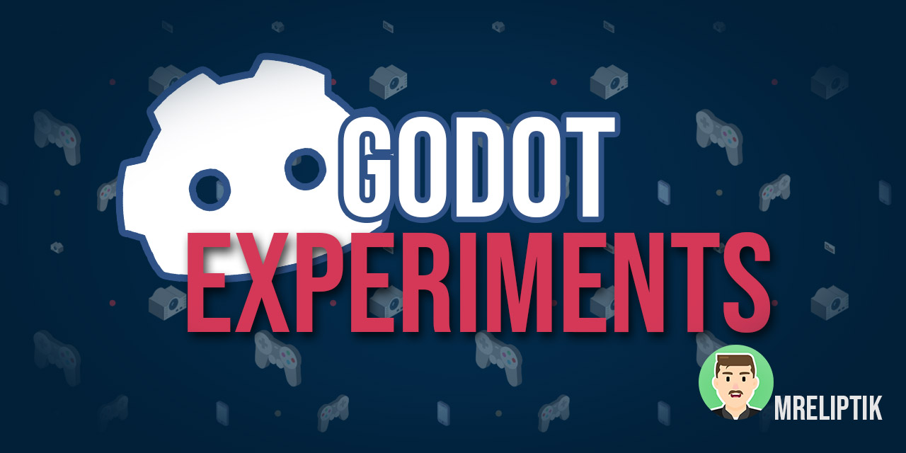

Some of my 2D/3D/VR/UI experiments in Godot. You can find some of my tutorials and experiments on my [YouTube channel](https://www.youtube.com/channel/UCANaLfiFwsHttGv6qGvSEIw).

## Projects & descriptions

| Icon | Type   |  Tittle | Description | Status |
:-----:|:-------:|:-------:|:-----------:|:------:|
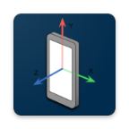| 2D | android_accelerometer | trying to use the accelerometer to set the gravity | DONE ✔
| 2D | loading_shader | simple laoding shader effects, from black and white to rgb | DONE ✔
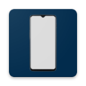 | 2D | mobile_ui | trying the Godot's UI node on mobile | DONE ✔
| 2D | quick_prototype | a small scene with a script to allow quick prototyping. You draw a shape with the line2D, and it automatically add a physics body and a background to your shape. | DONE ✔
| | | | |
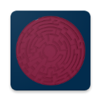 | 3D | android_maze_accelerometer | control a maze's orientation with the phone's acceleromter | DONE ✔
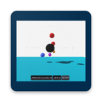 | 3D | area_gravity | a simple test using the gravity of an area | DONE ✔
 | 3D | balloon_deploy | recreating just cause balloon deploy mechanic with physics | DONE ✔
 | 3D | camera_wall | wall hiding to reveal player to the camera | DONE ✔
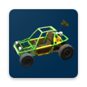 | 3D | car | a test with godot vehicle body physics and trial-like terrain | DONE ✔
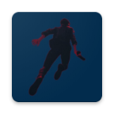 | 3D | control_remedy | mechanic re-creation from control remedy: grabbing and throwing object through telekinesis | DONE ✔
 | 3D | greenscreen_camera | a greenscreen effect to a camera. The camera only sees an object, allowing you to put something in the background, like an image. | DONE ✔
 | 3D | hoverboard | a physics based hoverboard, inspired by [Codeer](https://twitter.com/CodeerDev). | DONE ✔
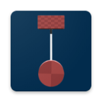 | 3D | inverted_pendulum | a test with bullet's physics. An inverted pendulm with an inertia wheel | DONE ✔
 | 3D | mirrors | two ways of faking mirrors | DONE ✔
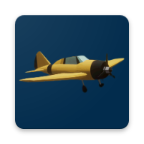 | 3D | plane | plane controller | WIP 🛠
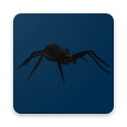 | 3D | procedural_animation | prodecural animation of a spider-like (or robot) model, with inverse kinematics | WIP 🛠
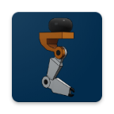 | 3D | robotic_arm | computer vision + IK test with a robotic pick and place arm | WIP 🛠
 | 3D | spectrum_analyzer | simple spectrum analyzer moving 3d objects | DONE ✔
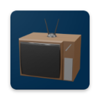 | 3D | tv | displaying a video or frames on a crt tv | DONE ✔
 | 3D | valheim_tree_chop | recreating the Valheim tree chop mechanic | DONE ✔
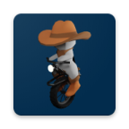 | 3D | wheelBot | a robot rolling on one wheel | DONE ✔
| | | | |
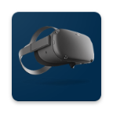 | VR | quest_playground | a project testing various things in VR for the Oculus Quest: handtracking, handtrackings physics | WIP 🛠
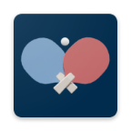 | VR | table_tennis | trying to use Godot's physic to recreate a table tennis game | WIP 🛠
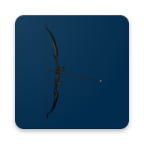 | VR | bow_and_arrow | bow and arrow mechanic | WIP 🛠
 | VR | control_like_interaction | trying to recreate CONTROL like movement, and messing with area's gravity | DONE ✔
| | | | |
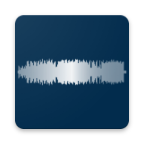 | MISC | audio_visualizer | represent the audio magnitude against time both left and right channel. Drawn as the song plays | WIP 🛠
 | MISC | instagram_ui | recreating some of Instagram's UI | DONE ✔
 | MISC | slow_down_sound | showcase an effect where the pitch and volume of the music is decreased with a tween. Useful for a "loosing" effect, when a player dies for example | DONE ✔
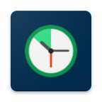 | MISC | slow_down_time | two ways of slowing down time | DONE ✔
 | MISC | tinder_ui | recreating some of Tinder's UI | DONE ✔

## Videos & GIFs

### Accelerometer android maze 3D

### Accelerometer android 2D

### Inverted_pendulum

### Area_gravity

### Camera_walls

### Audio_visualizer

### Car

### Greenscreen_camera

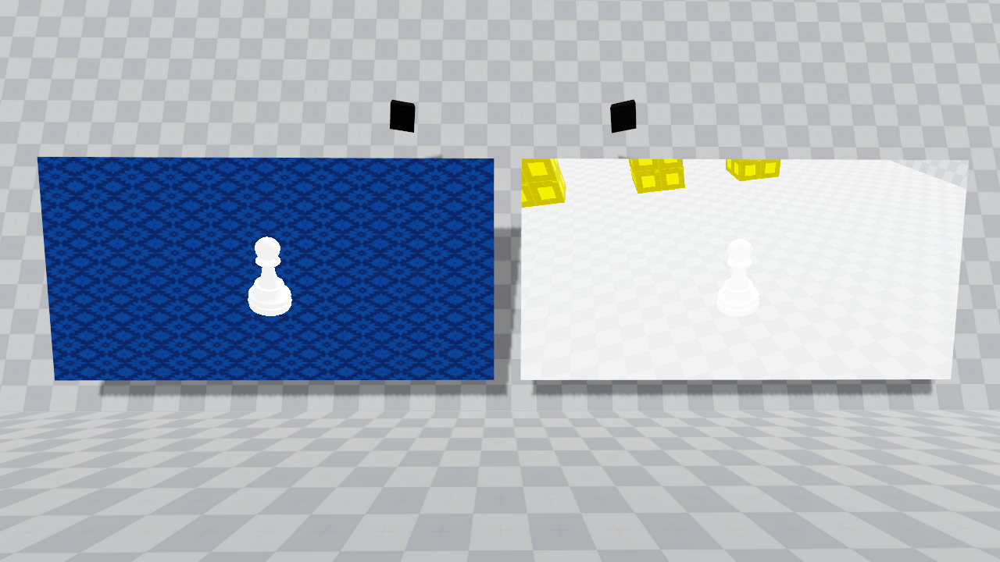

### Balloon_deploy

### Control_remedy

### Loading_shader

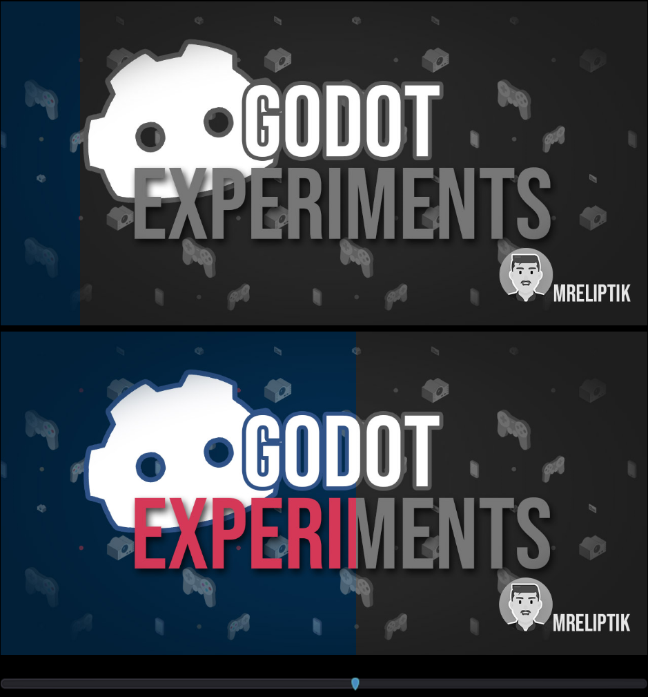

## Useful

- [3D/android_maze_acceloremeter]:
  - GLES2 was buggy for me, some texture were not shown
  - Bullet physics has a bug when you change the gravity vector at runtime -> use Godot physics instead
  

- [3D/robotic_arm]: 
  - GLES2 doesn't work correctly with IK, part of the mesh is not moved
  - Bullet physics' constant velocity for static body doesn't work -> use Godot physics instead
  - The IK target must be high in the tree than the SkeletonIK node, otherwise Godot freaks out

Icon background color: #022C4D

http://www.mazegenerator.net/

## About me

Software engineer & gamedev. 3D, 2D & VR. 

- [YouTube](https://www.youtube.com/channel/UCANaLfiFwsHttGv6qGvSEIw)
- [Twitter](https://twitter.com/VicMeunier) 
- [Instagram](https://www.instagram.com/vico.choco)
- [Itch.io](https://mreliptik.itch.io/)
- [Sketchfab](https://sketchfab.com/victor.meunierpk)

## LICENSE & Credits

This project is distributed under the MIT license, which it's free to use, modify and redistribute, for both personnal and commercial projects. For more information see [LICENSE.md](https://github.com/MrEliptik/godot_experiments/blob/master/LICENSE).

- **2D/android_accelerometer**: (texture + balls) [Kenney](https://www.kenney.nl/)
- **3D/android_accelerometer**: (Ball + flag) [Kenney](https://www.kenney.nl/)
